# S3 Executor Plugin User Guide

This is Sedy The S3 (Self Serve Services) Executor Plugin is a Jenkins build trigger plugin that configures S3 jobs into Jenkins automation pipeline. Jenkins admin registers S3 instances with valid tokens in the system configuration. Authenticated users can then configure and execute the jobs that are pre registered on those S3 instances in the automation process as simple build steps. Once a job has been executed, the plugin provides an option to sync the build with the job running on the S3 server by pulling the run state periodically from the S3.

## Objectives

The objective of this doc is to show how to:

* Install the executor plugin on Jenkins
* Configure the plugin
* Execute the plugin
* View the execution results

## Prerequisites

* Jenkins installation - version 2.54 or later
* Java 8

## S3 Executor Plugin Features
* Register and validate S3 instance on Jenkins.
* Validate and execute S3 jobs on jenkins as project build steps.
* Block Jenkins build step until the S3 jobs completed.

## Plugin Installation

### Step 1:
Download the plugin (HPI) file from here:

### Step 2:
Log in Jenkins. Click "Manage Jenkins" and then choose the "Manage Plugins" in the list.

### Step 3:
Go to "Advanced" tab. In the "Upload Plugin" section, choose to upload the _.hpi_ file that is previously downloaded from the local disk. Following the steps and Jenkins will automatically install/upgrade the plugin, restart the Jenkins after the installation finishes.

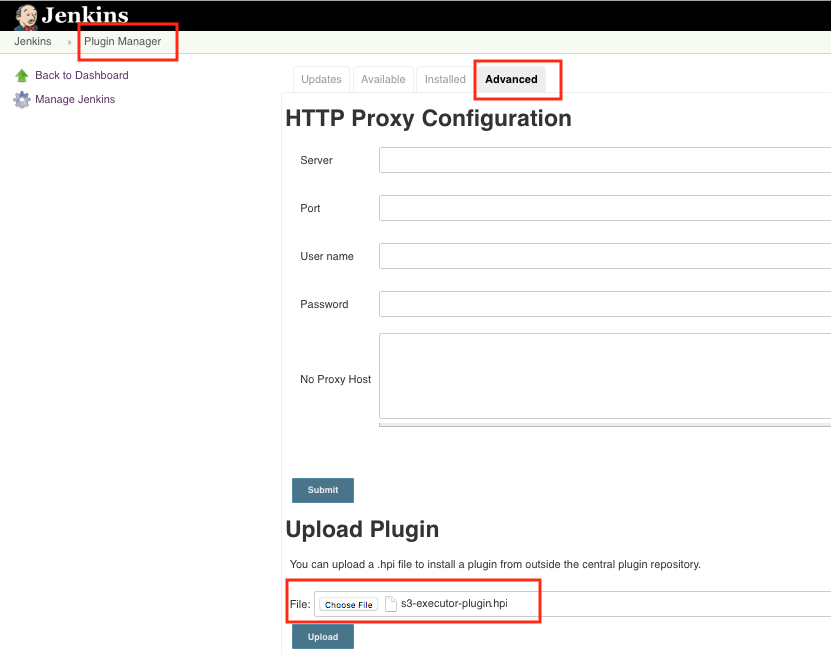

## Plugin Configuration

### System Configuration
Before the end users can use the plugin as the build steps in a Jenkins project, registration of S3 instances is required to be done first.

#### Step 1:
Go to "Manage Jenkins" and select "Configure System"

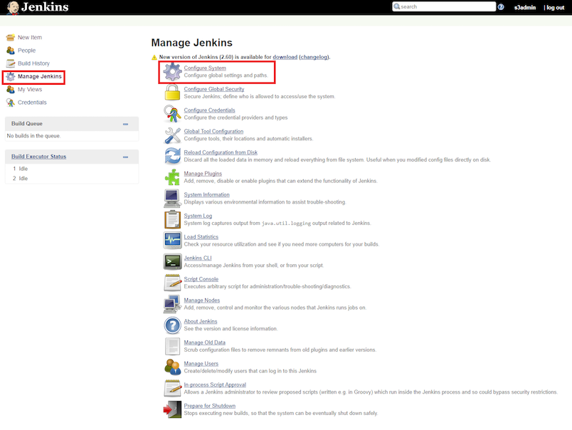

#### Step 2:
In the section of __Self Serve Services (S3) Servers Registration__, click the "Add" button to register a new S3 instance in Jenkins.

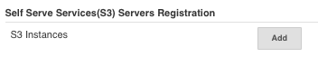

#### Step 3:
Enter the S3 information, which includes the S3 URL (for example: http://hostname:port), user name and the token. The user name and the token matches each other from the S3 server. The Executor Plugin uses the token-based authorization mechanism to verify the S3 Instances. All the fields must be valid in order for Jenkins to communicate with the S3. The "Validate" button helps to verify the information entered by the user. Click the "Add" button to add more S3 instances; click the "Delete" button to remove the current S3 instance.

`Note: The "Token" is the value of the token only, without any prefix (for example: Jwt).`
 
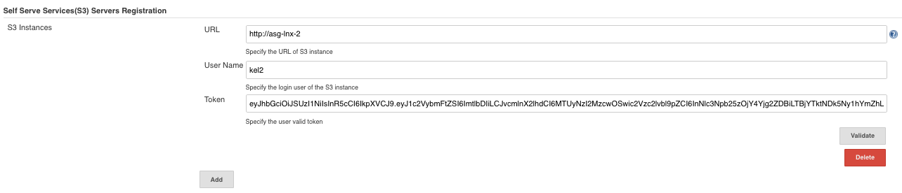

#### Step 4:
Once all fields have been filled, click the "validate" button. Possible validation messages are:
* Successful validation: `OK`
* Missing required info: `Required: host name, port, user name and token.`
* Wrong format: Error: `Invalid token format. Remove the token frefix: Jwt`
* Invalid token: `Fail to validate S3 instance with provided information. Make sure the token is valid!`
* User name dose not match its token: `Fail to validate S3 instance, username and token is not match.`
* Server connection issue: `Fail to validate S3 instance with provided information. Connect to xxx failed: Connection refused (Connection refused)`
* Any other issues from S3:
  * `fail to validate S3 instance, make sure S3 URL matches user with valid tocken. Unexpected response from S3 - 404: Not Found`
  * `fail to validate S3 instance, make sure S3 URL matches user with valid tocken. Unexpected response from S3 - 401: Unauthorized`

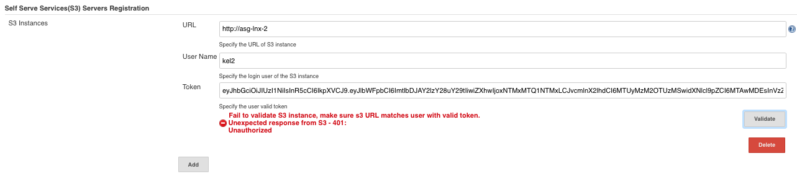

### Build Configuration
Add S3 jobs into the automation pipeline - configure build steps in Jenkins project.

#### Step 1:
Navigate to a Jenkins project and click the "configure" from the left.

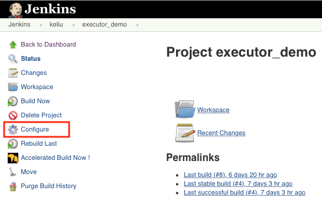

#### Step 2:
Add build step - __Execute S3 Job__.

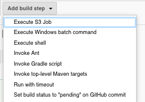

#### Step 3:
Configure the build step. 
* Choose one S3 URL from the S3 instances that pre registered in the previous steps, and select a associated user. The plugin will use the user's authentication token to communicate with the specified S3 instance.
* Fill out the rest of S3 job info in order:  branch, group, job, profile, testbeds/topology, max retention period. This requires the user having a job registration already done on the S3 server. All the fields need to match that job.
* Mandatory fields are "S3 URL", "User name", "Branch name", "Group name", "Job name", "Profile".
* The "Testbeds" field and the "Topology" field are optional and mutually exclusive, only one can be configured at a time. however, both can be empty if no testbeds/topology associated with the job.
* The "Max retention period" is optional. If not specified, run will be using the default value set on S3 for each job.
* The "Block until completed" option provides ability to sync up with the job running on S3. When option is checked, the job running state will be retrieved periodically (every 5 minutes), otherwise Jenkins will start the S3 job and finish. User can log into the S3 server to check the running state/result.
Click the "help" icon for the explanation of each field.
 
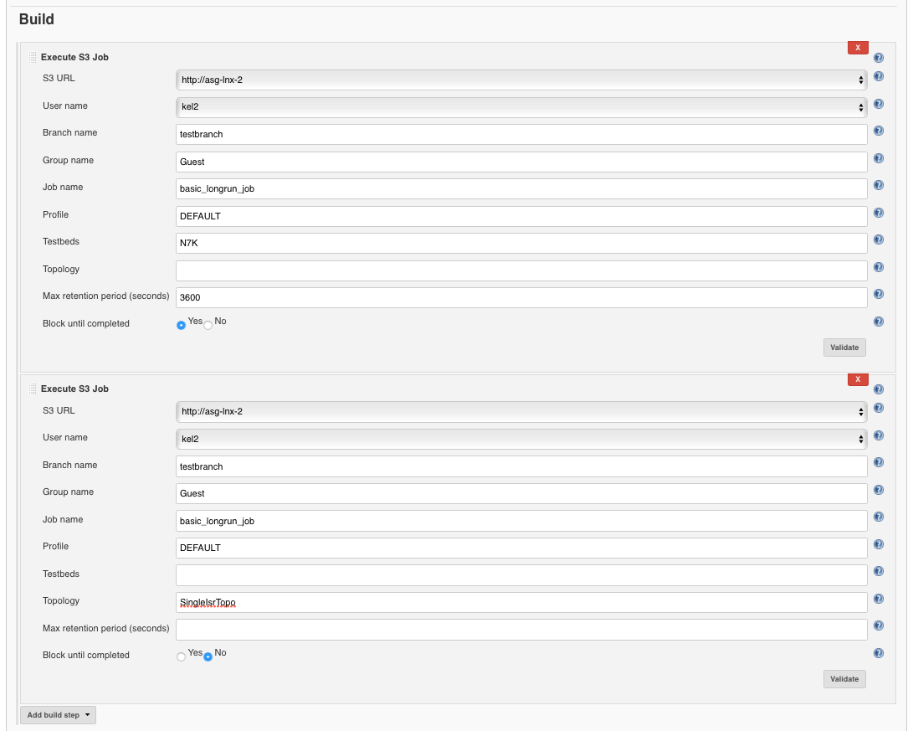

#### Step 4:
Once all the mandatory fields are filled, click "validate" to verify the S3 job configuration. 
Possible validation messages are:
* Successful validation: `Validation OK`
* Missing required info: `Required: S3 URL, User name, Branch name, Group name, Job name, Profile`
* Wrong info:
  * `Fail to validate S3 "branch" info from the entered branch name - xxx Unexpected response from S3 - 404:Not Found`
  * `Fail to validate S3 "group" info from the entered group name - xxx Unexpected response from S3 - 404:Not Found`
  * `Fail to validate S3 "job" info from the entered job name - xxx Unexpected response from S3 - 404:Not Found`
  * `Fail to validate S3 "profile" info from the entered profile name - xxx Unexpected response from S3 - 404:Not Found`
  * `Fail to validate S3 "testbeds" info from the entered testbed name - xxx Unexpected response from S3 - 404:Not Found`
  * `Fail to validate S3 "topology" info from the entered topology name - xxx Unexpected response from S3 - 404:Not Found`
* Wrong input: `Failed - configure either testbeds or topology, but NOT both at the same time!`
* Server connection issue: `Connect to xxx failed: Connection refused (Connection refused)`
* Any other issues from S3: `Fail to validate S3. Unexpected response from S3 - 401: Unauthorized`

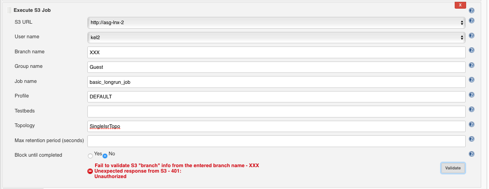

## Execution and Output

The S3 Executor plugin provides ability to sync up with the job running on S3. When the option is checked, Jenkins will keep running till the S3 job is complete. The job running state will be pulled from S3 every 2 minutes. This is very useful feature to control parallel runs with shared resources, for example testbeds. By default, the "Block till completed" option is unchecked to free up the Jenkins. In this case, Jenkins will start the S3 job, skip pulling the job state, and finish. The S3 job status URL will be provided on the console.

To execute the job, click "Build Now" on the project page:

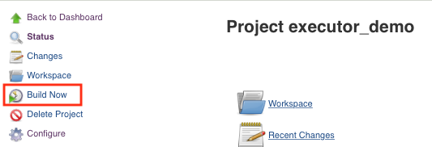

Example of output with the "block untill completed" option disabled: 

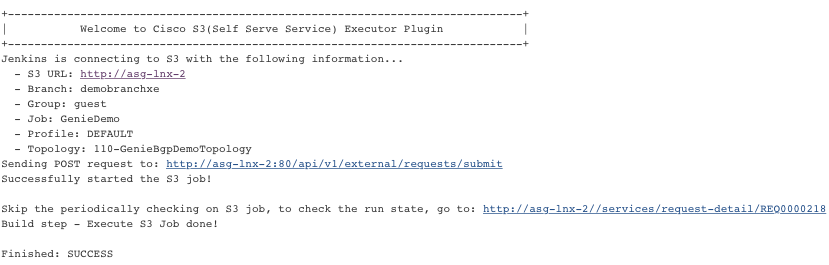

Example of output with the "block untill completed" option enabled:

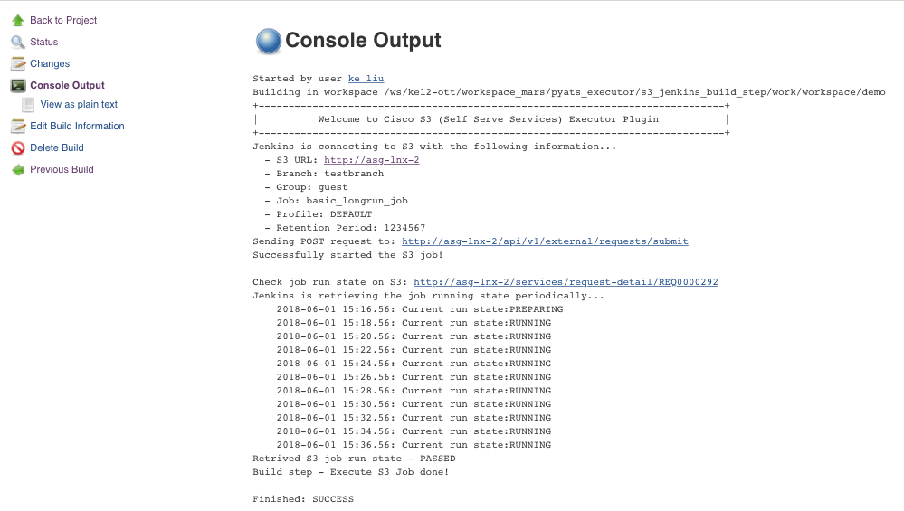
