# pyATS Project Plugin User Guide

The pyATS project plugin enables easy execution of pyATS easypy jobs.

## Objectives

The objective of this doc is to show how to:

* Install the Project plugin on Jenkins
* Configure the pyATS Project plugin
* Execute and View the test result
* Work with other related Jenkins Plugins
* Create and execute pyATS job via REST services

## Prerequisites

* Jenkins installation - version 2.54 or later
* Java 8

## pyATS Project Plugin Features  
* Running pyATS job
  * on a local host
  * on Jenkins remote node(s) / slave(s)
  * in Docker - pulling & running pyATS source code/docker image
* Runtime overwriting easypy job parameters
* Testbed cleaning and loading
  * via clean file / testbed file (file path)
  * via file parameterized plugin
* A pyATS Project configuration support
  * automaticaly generate system configuration
  * accept user defined configuration via Jenkins file parameterized component and merge with system configuration
* Email generation upon run completion with result of the run
* pyATS Project auto provisioning (via yaml file)
* Interface with pyATS Report plugin for log viewing and uploading to Cisco Self Serve Services (S3) portal and Cisco ATS TRADe.

## Plugin Installation

### Step 1:
Download the plugin (HPI) file from here:

### Step 2:
Log in Jenkins. Click "Manage Jenkins" and then choose the "Manage Plugins" in the list.

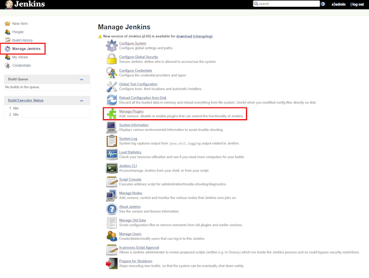

### Step 3:
From the "Manage Plugins" select the "Advanced" tab. In "Upload Plugin" section choose the .hpi file downloaded in step #1, and click on "upload". Follow through the steps prompted by jenkins to complete the installation. Jenkins will automatically install/upgrade the plugin, restart the Jenkins after the installation finishes.

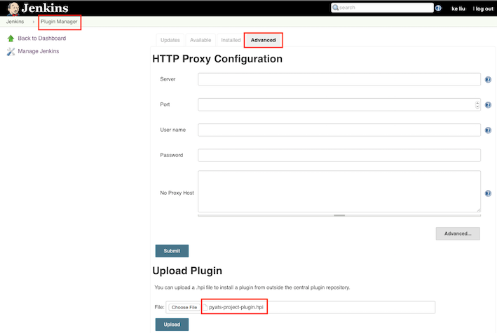

## Plugin Configuration

### Project Configuration

#### Step 1:

From the Jenkins home page, click "New Item" to bring the the Jenkins project creation page.

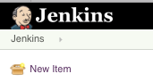

#### Step 2:

Provide the project name then pick the project type **pyATS Project**

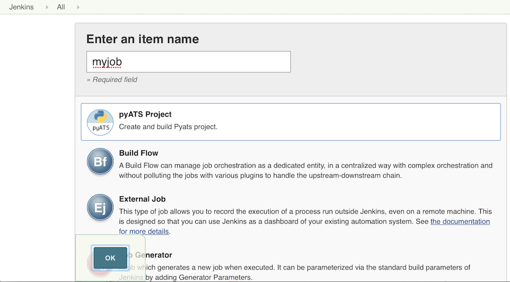

#### Step 3:

Click "OK" to be redirected to the project configuration page.

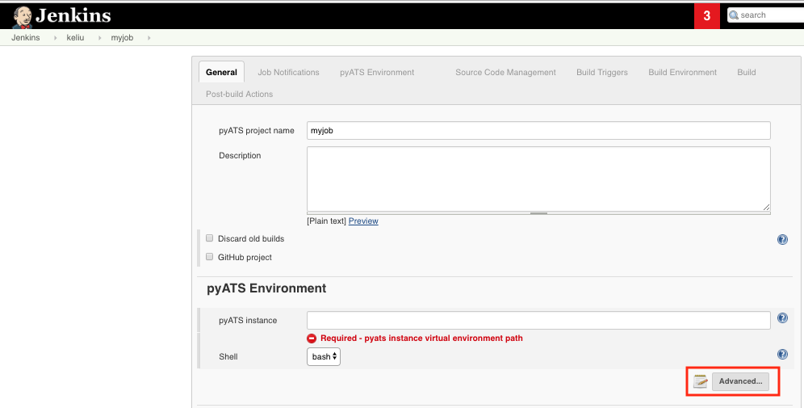

#### Step 4:
Configure the project mandatory parameter - pyATS instance (pyATS Virtual Env.). 

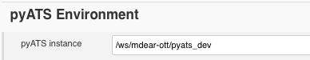

pyATS instance needs to be accessible from the Jenkins build node (master or slave). When required information is not provided, or if the path provided is not valid, and error message will be displayed. A pyATS instance path is considered to be valid if the pyATS virtual environment source file (activate/activate.csh) is present under the path specified (e.g.: path/bin/activate). Details on other configurable fields can be found in the __plugin components__ section below.

### Build Configuration

#### Step 1:
Add pyATS job as a build step, by selecting **Execute pyATS Job** from the list.
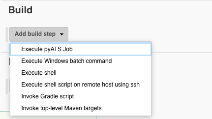

#### Step 2:

Specify the pyATS job file. The form validation will check if the job path is accessible from the current Jenkins running node (Master). A warning message is displayed if validation fails. The warning can be ignored in the following situations:
* The actual build happens on the remote/slave node which can access the job.
* pyATS job is in a _Docker_ environment.
* Jenkins parameter/variable is used here to present the job path.

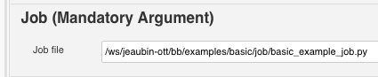

Click the **Save** button to save the configuration.

## Execution and Output

To execute the job, click "Build Now" on the project page:

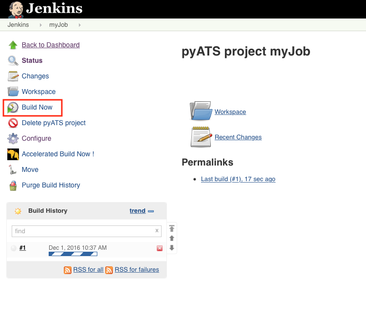

Runtime log can be viewed via native Jenkins "Console Output", or third party log viewer plugins user installed (Refer **Recommended Plugins** section).

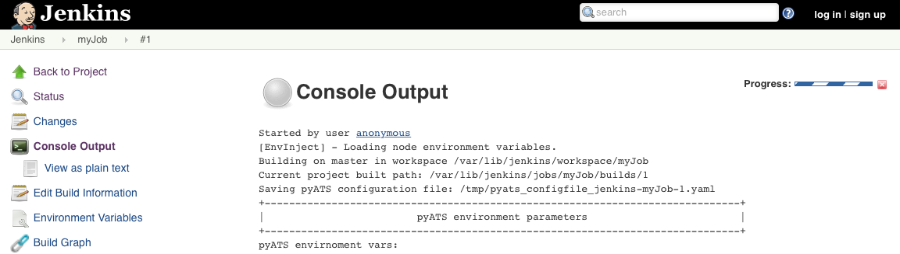

## Plugin Components

Other than the mandatory configurations described above, the plugin provide other optional configurations:

* pyATS Automated Provisioning
* pyATS Docker Configuration
* pyATS Job Environment Configuration
* More options within the "Execute pyATS Job" build step
* Runtime parameters 

### pyATS Auto Provisioning

On the project configuration page, click "Advanced..." in **pyATS environment** section to bring out the auto provisioning configuration.

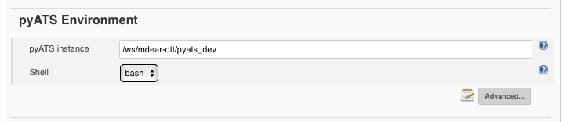

This feature enables configuring the pyATS jobs through a input file of _yaml_ format. The file location needs to be accessible by current Jenkins running node (Master). The pyATS parameters and values provided in the _yaml_ file will overwrite the values which maybe configured for the given attributes, any other parameters that are not part of the _yaml_ file will remain unchanged.

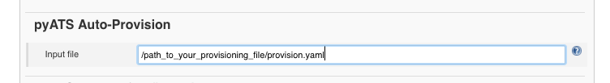

Details on the parameters, and their values can be found with the help (**?**) icon.

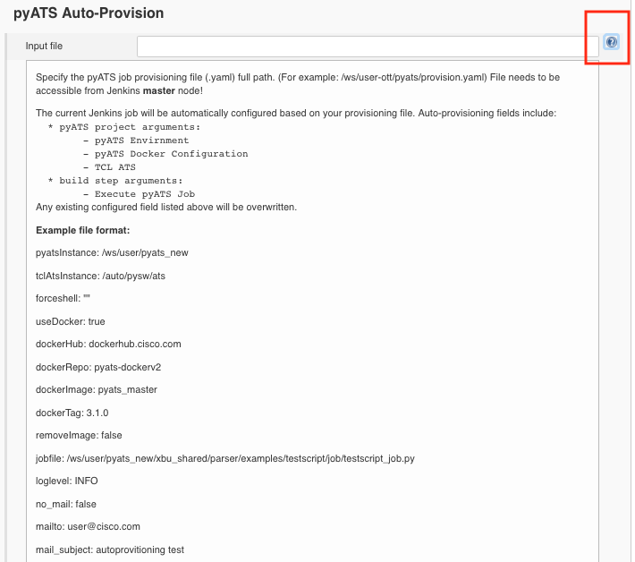

A form error will be generated when invalid _yaml_ format or incorrect parameters is encountered during loading of the _yaml_ file.

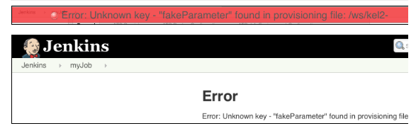

### pyATS Docker Configuration

The user can opt to run a pyATS easypy job inside a _Docker_ container that has a pyATS virtual environment installed.
Click "Advanced..." in **pyATS environment** section and enable running pyATS tests inside a Docker container.

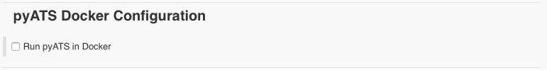

Check the option - __Run pyATS in Docker__, provide the required information. Click the help (**?**) to see the detail explanation for each field.

Steps to run pyATS in Docker:

* Pull the Docker image from a dockerhub specified
* Run a pyATS easspy job within the Docker container
* Close and remove Docker container
* Remove the Docker image if user chooses to

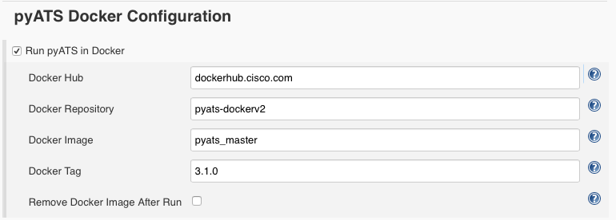

### pyATS Environment Configuration

This section allows user to configure pyATS project running environment. 

* The "pyATS instance" is the full path to the pyATS virtual environment. The path should be pyATS virtual instance location which can find the environment source file (activate/activate.csh) underneath, for example: _path/bin/activate_.
* The "shell" drop down menu allows user to switch the running shell environment between _bash_ and _cshell_.
* The "TCL ATS path" is the full path to the TCL ATS tree location which expect to find environment source file (env.sh/env.csh) underneath. 

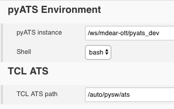

If "Run pyATS in Docker" option is selected, the path validation (pyATS instance and TCL ATS path) will be disabled due to possible inaccessibility between Jenkins server and docker environment. A warning reminds the user that it's the user's responsibility to make sure the path are correct in this situation. Otherwise all the paths provided will be validated.

### Execute pyATS Job (Build Step)

The "Execute pyATS Job" is the main functionality of pyATS project plugin. It adds pyATS jobs into Jenkins automation pipeline. User configures all the _easypy_ parameters via this component. To add this component, click "Add build step" and choose "Execute pyATS Job". Each Configurable field has its own help (__?__) for user to refer the usage. Self-validation also applicable on each field that warns user in most fallacious situation. 

Further explanation of some most used parameters (click "advance..." button to see the complete parameter list):

* Enable job uid - a unique ID associated with each job run (build). Jenkins *BUILD_TAG* (string of **jenkins-<JOB_NAME>-<BUILD_NUMBER>**) will be used as default value to make sure its uniqueness. It is user's responsibility to make sure it is a valid unique ID when enable the job uid and specify its own value.
* Job file - mandatory parameter for each pyATS job
* Testbed file - optional pyATS argument to specify testbed file location
* Clean file - optional pyATS argument to specify the testbed clean file location
* Disable email - default to be true to compliance to majority of pyATS customer solutions (e.g.: using Jenkins Email notification, etc.)
* xUnit directory - specify the directory where the xUnit files will be created. For this to work, "Enable xUnit report" option needs to be checked. For example, If user put Jenkins _workspace_ ($WORKSPACE) as the xUnit directory, the xUnit XML file will be created under Jenkins workspace after each run is complete.

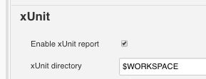

### Runtime Parameters Configuration
The project plugin allows Jenkins to encourage users to supply runtime job arguments, which overwrite the configuration parameters (predefined in job - configured in previous sections) at the time of each build. It is very useful when user run different sets of parameters for different builds but like to keep static default values for the job itself. Users do not need to create different jobs to simply hold different sets of parameters.

To enable the feature, on the job configuration page, enable the checkbox "This project is parameterized", and then add a parameter by selecting "Add Parameters".

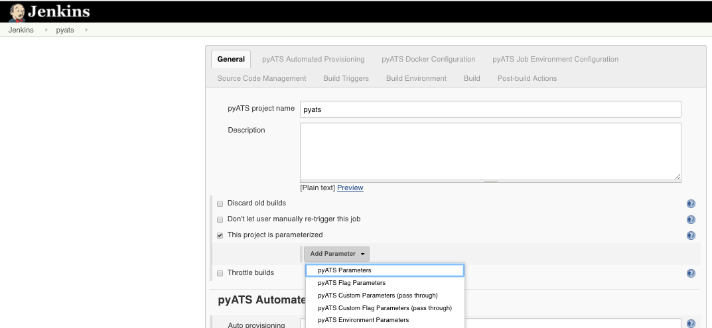

There are six groups of pyATS parameters available for users to use:

* pyATS Parameter - Defines pyATS internal parameters. The parameters defined here will override the ones defined in "Execute pyATS Job" from "Add build step" component described in previous section.

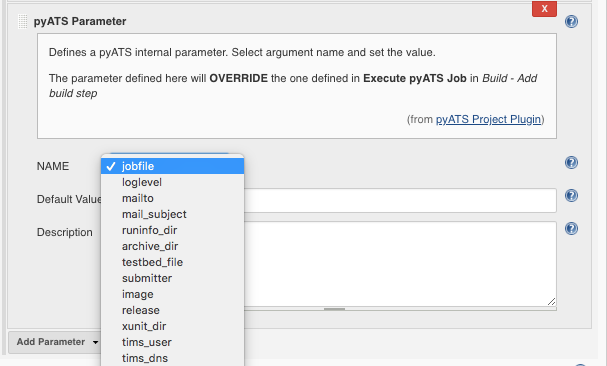

* pyATS Flag Parameter - Defines pyATS flag parameters. The parameters defined here will override the ones (Boolean parameters) defined in "Execute pyATS Job" from "Add build step" component. Check the checkbox to send to _easypy_ as _-arg_; uncheck the box, the arguments won't be built for _easypy_.

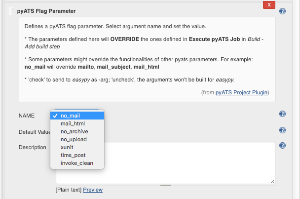

* pyATS Custom Parameter - Defines pyATS user script parameters which are the key value pairs. These parameters are used in the pyATS scripts as user defined pass through arguments. The prefix ("--") has to be added in front of the variable name. For example: --abc

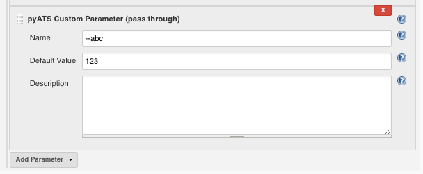

* pyATS Custom Flag Parameter - These parameters are used in the pyATS scripts as user defined pass through Boolean arguments. Check the checkbox to send to _easypy_ as _--arg_; uncheck the box, the arguments won't be built for _easypy_. The prefix ("--") has to be added in front of the variable name. For example: --abc

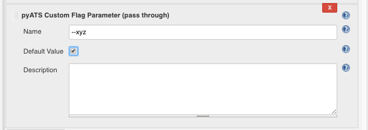

* pyATS Environment Parameter - This component allows users to set the pyATS virtual environment variables before executing any pyATS script. The variables are defined here will be set and exported to pyATS execution environment properly according to the running shell environment setup - _bash_ or _csh_.

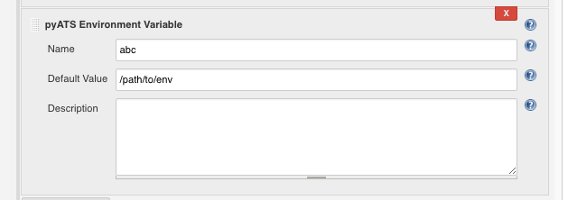

* File Parameter - Plugin uses Jenkins native _File Parameter_ to pass two important files into pyATS jobs. These specific pyATS parameters are prefixed with  *pyats_*  and provide information on:
  * **pyats_cleanfile.yaml** - user can supply the pyATS clean file into the run instead of path of the file.
  * **pyats_userconfig.yaml** - user can supply the pyATS user config file into the run instead of using default pyATS system config.

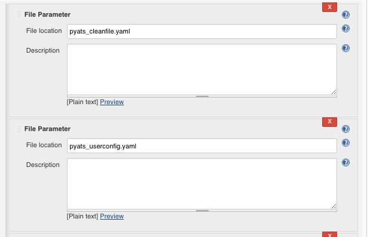

When execute the build with parameters, user can dynamically change the parameter values for each run.

A parameter with a prefix "**-**" indicating it is a pyATS internal parameter (easypy argument). A parameter starts with "**--**" indicates that it is a pyATS script (pass though) parameter. A parameter within "**Env()**" indicates that it is a pyATS environment parameter.If any parameter has no prefix, it is a Jenkins native parameter.

By the end of the run, user can review the runtime parameters used in this build, and also can refer to parameter usage history to compare with the other builds.

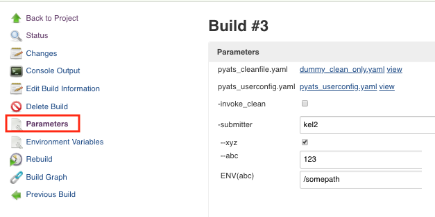

## Related plugins

### pyATS Report Plugin

`It is mandatory to install the pyATS Report Plugin with the pyATS Project plugin to ensure uploading of the result of each build to Cisco Self Serve Services (S3) dashboard and/or Cisco ATS TRADe dashboard.`

The pyATS Report Plugin is a Post Build plugin that can display Cisco test automation results within Jenkins. The plugin extracts and parses the results archive (zip file) generated by Cisco test infrastructure such as Easypy (pyATS) and Autoeasy (tcl ATS) and displays the testcase results within Jenkins. It also provides the option to upload the result of each build to Cisco Self Serve Services (S3) dashboard and Cisco ATS TRADe dasboard.

For more details, refer to the **pyATS Jenkins Report Plugin User Guide**.

### Other Recommended Plugins

The following native Jenkins components and external plugins are tested with the pyATS project plugin. Jenkins will provide complete customized end-to-end solutions for cisco test community by selectively combining the following useful components/plugins with pyATS Project Plugin.

* Jenkins parameterized build component

This components allows user build the Jenkins job with parameters. This plugin should not be confused with the pyATS **runtime parameter** feature as they provide the way to generate pyTAS internal, pyATS script, and pyATS environment arguments only.  The "parameterized build component" plugin  provides a mechanism to supply arguments for Jenkins builds.

https://wiki.jenkins-ci.org/display/JENKINS/Parameterized+Build

* Jenkins Slave/Node component

This component makes the build distribution concurrently or sequentially execution possible.
https://wiki.jenkins-ci.org/display/JENKINS/Distributed+builds

To add new slave: From "Manage Jenkins" click "Manage Nodes" then "New Node".

Choose via SSH to launch the slave agent.

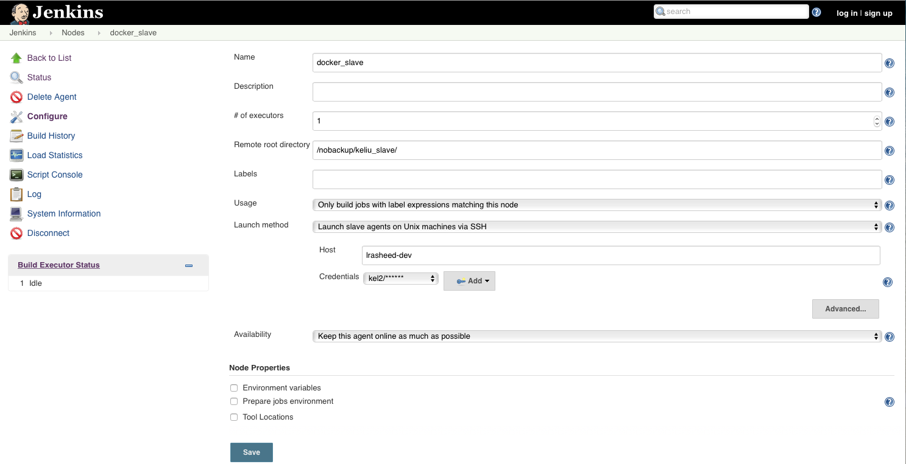

User can specify the execution server by enabling "Restrict where this project can be run" on job configuration page.

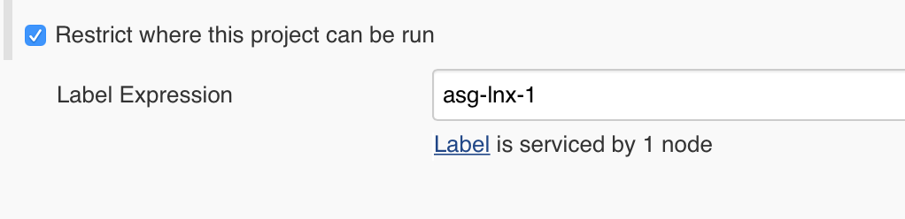

* Jenkins Execute shell

This component allows user to execute single or multiple shell scripts (python, groovy, et.) as a part of Jenkins build steps. User can leverage this component to define pyATS prebuild /postbuild steps and work with pyATS build step.

* Build Flow Plugin

This is a third party plugin that allows managing Jenkins jobs orchestration using a dedicated DSL, extracting the flow logic from jobs.

https://wiki.jenkins-ci.org/display/JENKINS/Build+Flow+Plugin

* Build Monitor Plugin

Third party plugin provides a highly visible view of the status of selected Jenkins jobs.

https://wiki.jenkins-ci.org/display/JENKINS/Build+Monitor+Plugin

* Build Graph View Plugin

Third party plugin computes a graph of related builds starting from the current one, and render it as a graph. 

https://wiki.jenkins-ci.org/display/JENKINS/Build+Graph+View+Plugin

* Lockable Resources Plugin

Third party plugin allows to define lockable resources (such as TESTBEDS, execution servers, etc.) that can be used by builds.

https://wiki.jenkins-ci.org/display/JENKINS/Lockable+Resources+Plugin

* EnvInject Plugin

Third party plugin makes it possible to have an isolated environment for the jobs.

https://wiki.jenkins-ci.org/display/JENKINS/EnvInject+Plugin

* Email-Ext Plugin

Third party plugin allows user to configure every aspect of email notifications. 

https://wiki.jenkins-ci.org/display/JENKINS/Email-ext+plugin

* HTML Publisher Plugin

Third party plugin publishes HTML reports. 
https://wiki.jenkins-ci.org/display/JENKINS/HTML+Publisher+Plugin

* JUnit Plugin

Third party plugin allows JUnit-format test results to be published. To make the pyATS Project Plugin generate xunit XML file, refer to section **Execute pyATS Job - xUnit directory** described above.

https://wiki.jenkins-ci.org/display/JENKINS/JUnit+Plugin

## REST Web Services

The section describes how to use Jenkins REST APIs to create, configure, run, remove, and monitoring a pyATS project.

Create a pyATS Project with Mandatory Configuration

* REST API to call: POST JENKINS_URL/createItem?name= JOBNAME

Example: POST http://10.85.xx.xx:8080/createItem?name= myjob

Example of config.xml file that needs to be provided with REST to configure the job:

* Build a pyATS Job

REST API: POST JENKINS_URL/job/JOBNAME/build

Example: POST http://10.85.xx.xx:8080/job/myjob/build

* Build the pyATS Job with Parameters

REST API: POST JENKINS_URL/job/JOBNAME/buildWithParameters?var=value

Example: POST http://10.85.xx.xx:8080/job/myjob/buildWithParameters?mail_subject=test

* Removing a pyATS Project

RESTAPI: JENKINS_URL/job/JOBNAME/doDelete

Example: http://10.85.xx.xx:8080/job/myjob/doDelete

* Monitoring Current Build

REST API: JENKINS_URL/job/JOBNAME/lastBuild/api/xml

Example: http://10.85.xx.xx:8080/job/myjob/lastBuild/api/xml
