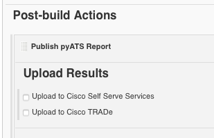

# pyATS Report Plugin User Guide

The pyATS Report Plugin is a Post Build plugin to display Cisco test automation results within Jenkins. The plugin extracts and parses the results archive (zip file) generated by Cisco test infrastructure such as Easypy (pyATS) and Autoeasy (tcl ATS) and displays the testcase results within Jenkins. It also provides the option to upload the result of each build to Cisco Self Serve Services (S3) dashboard and Cisco ATS TRADe dashboard.

## Objectives

The objective of this doc is to show how to:

* Install the report plugin on Jenkins
* Configure the plugin
* Execute the plugin
* View the execution results

## Prerequisites

* Jenkins installation - version 2.54 or later
* Java 8

## pyATS Report Plugin Features
* Extracting ResultsDetails.xml XML results file from a specified archive (zip file).
* Extracting ResultsDetails.xml XML results file from the archive (zip file) saved to the Jenkins *workspace* by Easypy.
* Display within Jenkins, overall breakdown of results of the build with pie charts.
* Display within Jenkins, individual testcase details, actual results and run time.
* Upload the build results to S3 dashboard
* Upload the build results to Cisco TRADe.

## Plugin Installation

### Step 1:
Download the plugin (HPI) file from here:

### Step 2:
Log in Jenkins. Click "Manage Jenkins" and then choose the "Manage Plugins" in the list.


### Step 3:
Go to "Advanced" tab. In the "Upload Plugin" section, choose to upload the _.hpi_ file that is previously downloaded from the local disk. Following the steps and Jenkins will automatically install/upgrade the plugin, restart the Jenkins after the installation finishes.


## Plugin Configuration

### Post Build Configuration

#### Step 1:
On project configuration page, click on "Add post-build action" button to select "Publish pyATS Report" from the list of all the post-build plugins installed on the Jenkins instance.


#### Step 2:
Depends on the project type,  the report plugin interface will be slightly different.

__For pyATS project__:

In pyATS Project, the report plugin looks for the Cisco-test-results archive that has been created by _pyATS Project plugin_ and saved to Jenkins _workspace_.
User has choices of uploading the archive to S3 (Cisco Self Services) or Cisco ATS TRADe.



__For any other project than pyATS project (e.g.: free style project)__:

* User have to specify the Cisco-test-results archive (zip file) manually by providing the absolute path to the archive. The file has to be accessible from the build node (master/slave).
* As soon as user enters the path, in the background Jenkins will do the path validation. In the event of the file not being found/reachable from the current running node (master node), warning message displays. User can ignore the warning message if variable has been used for the entered path, or the build and the archive file are located on remote/slave node.
* User has choices of uploading the archive to S3 (Cisco Self Services) or Cisco TRADe.


#### Step 3:
Configuring the "Upload Results", user has the options of uploading the Cisco test results archive to two consumers which are:
* Cisco Self Serve Services (S3) dashboard
* Cisco ATS TRADe dashboard

__Upload to Cisco Self Serve Services (S3):__

Uploading to S3 requires the authentication token. Refer to *Plugin Parameter Configuration - s3_auth_token* section below for the required configuration details.
* To upload the archive to the S3 dashboard, user must specify the S3 server as format such as:
  * http://hostname
  * http://hostname:port
* Specify the S3 *Request ID* that is the identifier for a unique run request. A single run request can have multiple runs.


__Upload to Cisco TRADe:__

To upload the archive to Cisco's TRADe dashboard, check the option box.


### Plugin Parameter Configuration

Parameters can be passed via Jenkins to S3 through Jenkins native password and string parameterize component. These specific S3 parameters are prefixed with  *s3_*  and provide information on:
* **s3_auth_token**: s3 automation token (provide via Jenkins password parameter)
* **s3_branch**: indicating the S3 branch the current run belongs to (provide via Jenkins string parameter)
* **s3_component**: indicating the component in S3 the current run belongs to (provide via Jenkins string parameter)

Among these three parameters, *s3_auth_token* is the mandatory parameter to upload result archive to S3. The S3 will use this authentication token to grant the uploading permission for Jenkins. The *s3_branch* and *s3_component* are optional fields. If user specify these two parameters, Jenkins will tag those information with the run and post to S3.


## Execution and Output

To execute the job, click "Build Now" on the project page:


### View Results on Jenkins
If the XML results file (ResultsDetails.xml) from the archive (zip file) has been successfully parsed, after the build is completed, the "Build Result Summary" page will be displayed under each build. Clicking the Jenkins project *build number* will direct user to "build result summary" page. In here, user can view the general information of the job, including the job ID, submitter, testbed, job environment, execution server, runtime, etc; also the report provides the overall result (pass/fail percentage) of the run.

Example of "Build Result Summary" output: 


Clicking the **Build # pyATS report** link, user can view the details of each test case.

Example of "Testcase Detailed Results" output:


### View Self Serve Services (S3) Results
If user enables the "Upload to Cisco Self Serve Services" option in the post build step, and the result has been successfully uploaded, a link to access the S3 results can be found on left side of the menu in each build. Clicking "Cisco S3 Result" will direct the user to the result detail page of the job on S3. User might have to login to view the S3 result.

  

### View Cisco Trade Results
If user enables the "Upload to cisco TRADe" option in the post build step, and the result has been successfully uploaded, a link to access the TRADe results can be found on left side of the menu in each build. Clicking "Cisco TRADe Logs" will direct the user to the result detail page of the Cisco TRADe.

  

## Report Plugin XML Specification

The following is the complete XML specification to remotely configure the pyATS Report Plugin:

```
<publishers>
    <asg.pyats.plugins.pyatsreport.PyATSReportPublisher plugin="pyats-report-plugin@1.0">
        <zipFile/>
        <uploadS3>true</uploadS3>
        <s3Server>some-server:8088</s3Server>
        <s3RequestId>req001</s3RequestId>
        <uploadTrade>true</uploadTrade>
    </asg.pyats.plugins.pyatsreport.PyATSReportPublisher>
</publishers>
```

XML Tag Details:
* zipFile: A Cisco test archive file that the user wishes to use for uploading. For non-pyATS project only.
* uploadS3: Option to upload the Cisco test results to the Cisco Self Serve Services (S3) dashboard.
* s3Server: [Optional] If the user has selected "Upload to Cisco Self Serve Services", the user must provide the server hosting the S3.
* s3RequestId: [Optional] If the user has selected "Upload to Cisco Self Serve Services", the user can provide the S3 request ID.
* uploadTrade: Option to upload the Cisco test results to Cisco's eARMS TRADe dashboard.

To upload to S3, authentication token needs to be included in the XML as well:

```
<properties>
    <hudson.model.ParametersDefinitionProperty>
        <parameterDefinitions>
            <hudson.model.PasswordParameterDefinition>
                <name>s3_auth_token</name>
                <defaultValue>{token value}</defaultValue>
            </hudson.model.PasswordParameterDefinition>
        </parameterDefinitions>
    </hudson.model.ParametersDefinitionProperty>
</properties>
```

Details can also be found on the (**?**) help for each configurable item on the Jenkins post-build actions UI.

## Uploading ATS TCL Script Result Example

User can run TCL scripts (e.g.: ATS scripts) on Jenkins free style project and use the Report Plugin for uploading. Below is an example setup to run a  cisco-shared *cAAt* sample script.

### step 1:

Create a new free style project on Jenkins.


### Step 2:

Add a build step - *execute shell* (Below example only shows one way to configure the TCL ATS run; there are many ways to run ATS jobs in Jenkins)
* Source the ATS tree.
* Run a ATS script with "autoeasy", and save the result archive into specific directory that the "-ad" argument specified. 
* Rename the archive file to Jenkins BUILD_TAG.zip.


### Step 3:

Add a post build action to publish ATS test report
* Specify the archive file location
* Provide the S3 server which to view the result


### Step 4:

View build results on Jenkins.


### Step 5:

View Self Serve Services (S3) Results.

