# pyATS Report Plugin User Guide

The pyATS Report Plugin is a Post Build plugin to display Cisco test automation test results within Jenkins, with options to upload the result to Cisco TRADE and/or to Cisco Self Serve Services(S3) Portal. The Report Plugin is designed to work with pyATS Project(for pyATS based scripts), as well as Jenkin Free Style project(for TCL based scripts). 

## Objectives

The objective of this doc is to show how to:

* Install the Report plugin  
* Configure the Report plugin
* Execute and Test Result Report  
* View the test result in Self Serve Services(S3) Portal
* View the test result in Trade 
* Report Plugin XML Specification

## Prerequisites

* Jenkins installation - version 2.54 or later
* Java 8

## pyATS Report Plugin Features
* Extract ResultsDetails.xml results file from a specific archive location(Free Style Project) or from the Jenkins _workspace_ (PyATS Project)
* Provide Test suite, and testcase result details with Trend graphs
* Option to upload the results to Cisco S3 and/or Cisco TRADe
* Pointer to direct view from S3 Dashboard

## Plugin Installation

### Step 1:
Download the plugin (HPI) file from:

### Step 2:
Log in Jenkins, click "Manage Jenkins" and choose "Manage Plugins" from the list.


### Step 3:
From the "Manage Plugins" select the "Advanced" tab.  In "Upload Plugin" section choose the _.hpi_ file downloaded in step #1, and click on "upload".  Follow through the steps prompted by jenkins to complete the installation.  This restart of jenkin is optional, and not required for this plugin.   


## Plugin Configuration

### Post Build Configuration

#### Step 1:
Navigate to project configuration, click on "Add post-build action" and select "Publish pyATS Report" from the list.

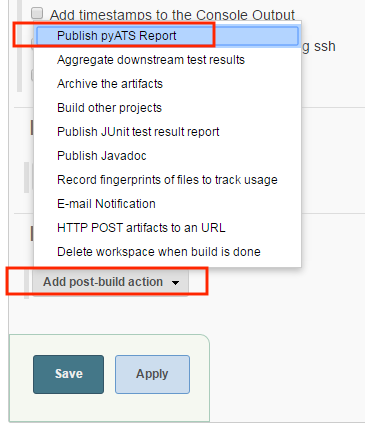

#### Step 2:
Based on the the project type (pyATS Project or FreeStyple Project) the Report plugin interface will have minor differences depending on where the _test result archive (.zip)_ is saved.  The _pyATS Project_  saves the test results archive in Jenkins _workspace_ where as the _Free Styple Project plugin_ saves the Test result archive in user specified location. 

_Free Style project_:

* Specify the absolute path to the Test result archive file.  The file must be accessible from the build node (master/slave).
Report Plugin will validate the specified path, in the event of the file not being found/reachable from the current running node (master node), warning message displays. These warning message should be ignored if a _variable_ is used to specify the path, or the build and the archive file are located on remote/slave node.

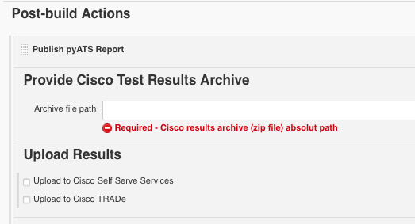


#### Step 3:
Select where the result to be uploaded.

__Cisco TRADe:__

To upload the archive to Cisco's TRADe dashboard, check the option box.

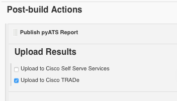

__Cisco Self Serve Services (S3):__

To upload the archive to the S3 portal specify:
* The S3 instance URL:
  * http://hostname
  * http://hostname:port
* The S3 top level *Request ID*  

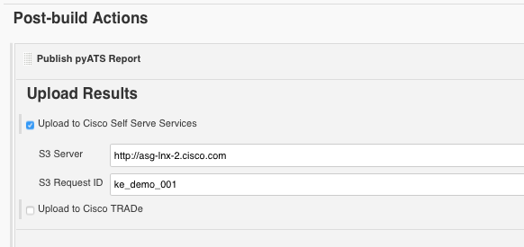

### S3 Parameter Configuration

Uploading resuls to S3 requires REST API authentication. This is a mandatory parameter to grante the uploading permission from Jenkins. The Authentication Token Parameters is specified through Jenkins native _Password Parameter_ component. Other optional S3 execution specific Parameters is specified through Jenkins native _String Parameter_ component.  

S3 specific parameters are prefixed with *s3_* such as:  
* **s3_auth_token**: s3 automation token (mandatory parameter)
* **s3_branch**: indicating the image branch for the execution (optional parameter)
* **s3_component**: indicating the feature component the sanity job covers (optional parameter)

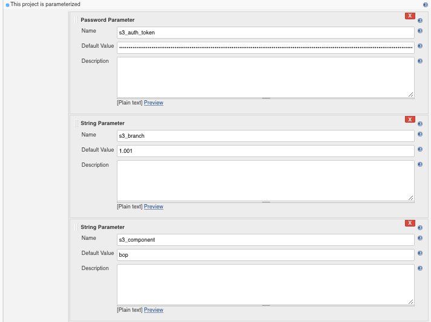

## Execution and Output

To execute the job, click "Build Now" on the project page:

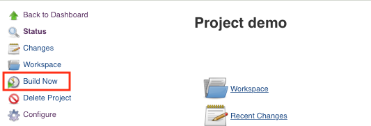

### View Results on Jenkins
As the build is completed go to "Build Result Summary" page, click on Jenkins project *build number* to be redircted to  "build result summary" page.  

Example of "Build Result Summary" output: 

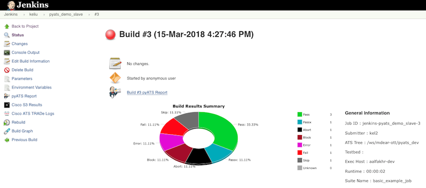

The general information of the job, the report provides the overall result (pass/fail percentage) of the run. Click the **Build # pyATS report** link to view the details of each Test. 

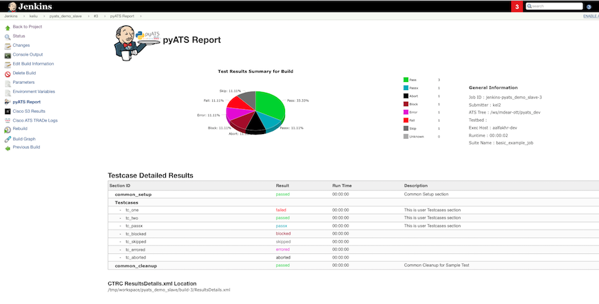

### View results from Cisco Self Serve Services (S3) dashboard
Click "Cisco S3 Result" will go directly to S3 instance the result is uploaded to.    

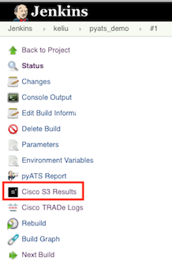  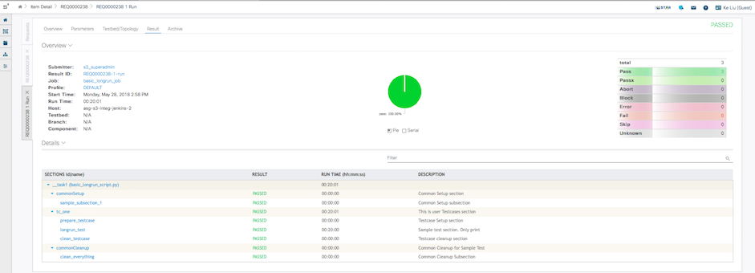

### View Result from Cisco Trade 
Click "Cisco TRADe Logs" will go directly to Cisco TRADe the result is uploaded to.

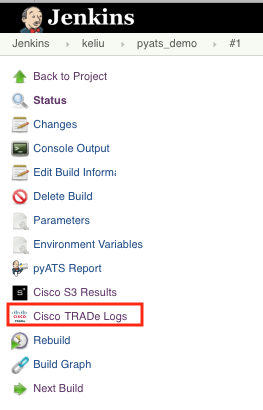  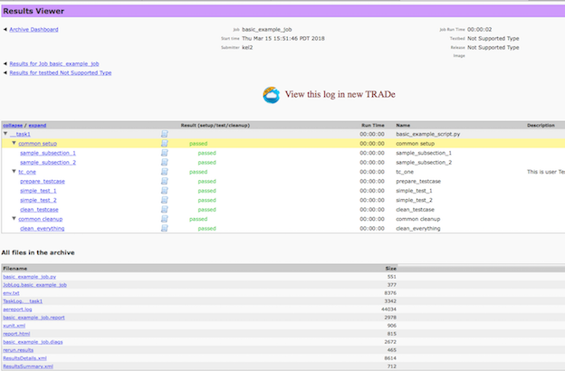

## Report Plugin XML Specification

The XML specification to remotely configure the pyATS Report Plugin (throught REST API):

```
<publishers>
    <asg.pyats.plugins.pyatsreport.PyATSReportPublisher plugin="pyats-report-plugin@1.0">
        <zipFile/>
        <uploadS3>true</uploadS3>
        <s3Server>some-server:8088</s3Server>
        <s3RequestId>req001</s3RequestId>
        <uploadTrade>true</uploadTrade>
    </asg.pyats.plugins.pyatsreport.PyATSReportPublisher>
</publishers>
```

XML Tag Details:
* zipFile: [Free Style Project] A Cisco test archive file that the user wishes to use for uploading.  
* uploadS3: Option to upload the Cisco test results to the Cisco Self Serve Services (S3) portal.
* s3Server: S3 instance URL is required.  
* s3RequestId: The S3 request ID.
* uploadTrade: Option to upload the Cisco test results to Cisco Trade. 

To upload to S3, authentication token is required:

```
<properties>
    <hudson.model.ParametersDefinitionProperty>
        <parameterDefinitions>
            <hudson.model.PasswordParameterDefinition>
                <name>s3_auth_token</name>
                <defaultValue>{token value}</defaultValue>
            </hudson.model.PasswordParameterDefinition>
        </parameterDefinitions>
    </hudson.model.ParametersDefinitionProperty>
</properties>
```

Details can also be found on the (**?**) help for each configurable item on the Jenkins post-build actions UI.

## FreeStyple Project for ATS TCL Script 

### step 1:

Create a new free style project on Jenkins.

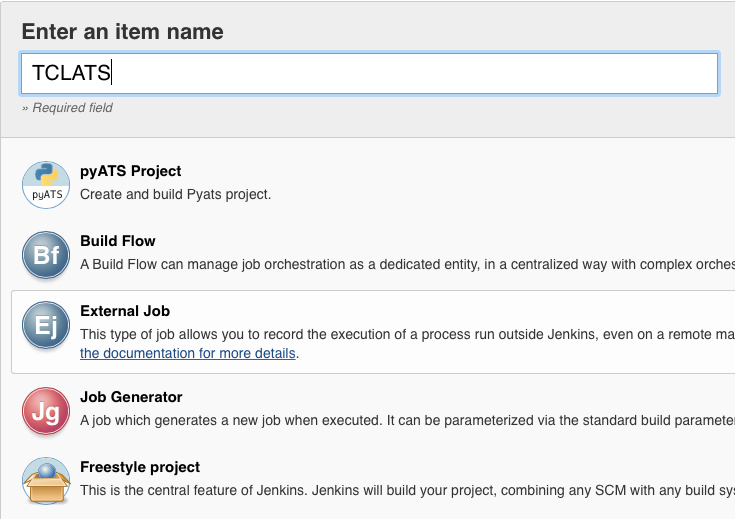

### Step 2:

Add a build step - *execute shell* (Below example only shows one way to configure the TCL ATS run; there are many ways to run ATS jobs in Jenkins)
* Source the ATS tree.
* Run a ATS script with "autoeasy", and save the result archive into specific directory that the "-ad" argument specified. 
* Rename the archive file to Jenkins BUILD_TAG.zip.

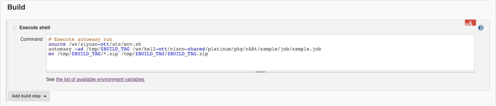

### Step 3:

Add a post build action to publish ATS test report
* Specify the archive file location
* Provide the S3 server which to view the result

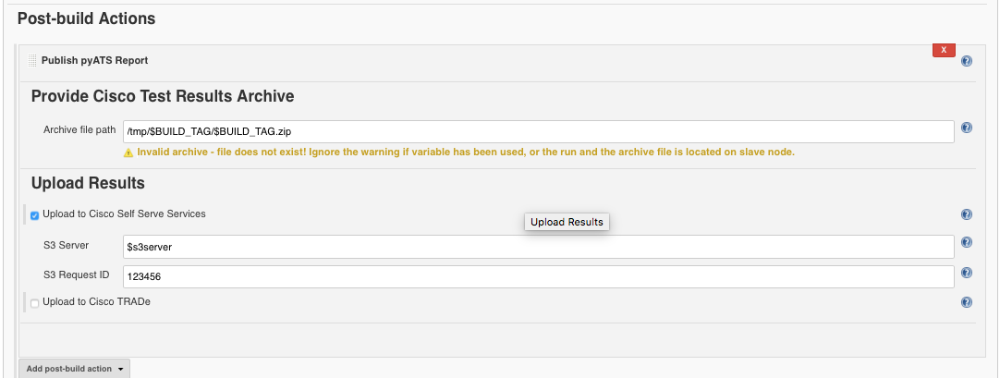

### Step 4:

View build results on Jenkins.

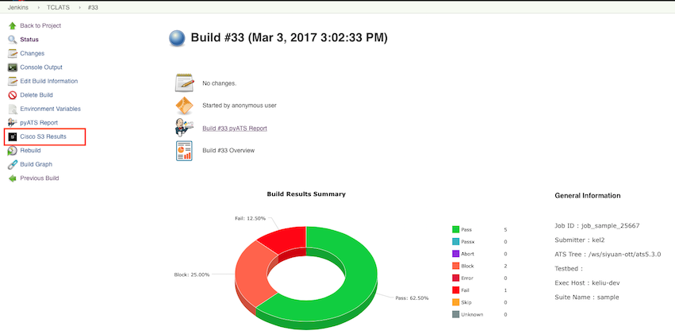

### Step 5:

View Self Serve Services (S3) Results.

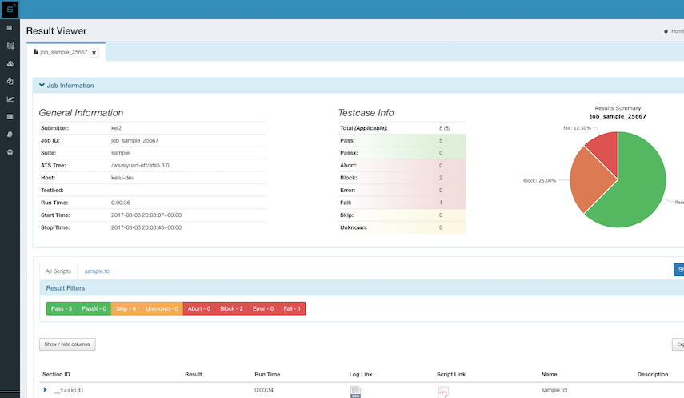
